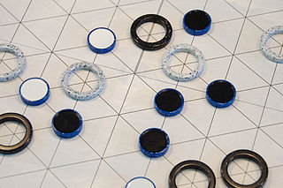
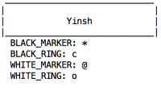
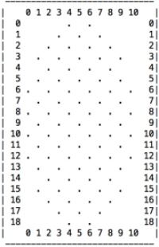
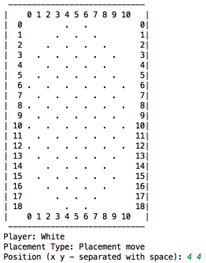
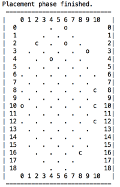
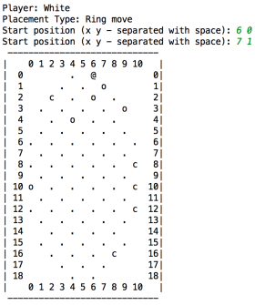
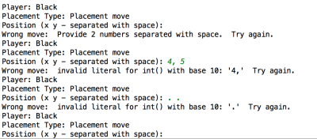
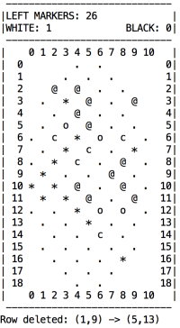
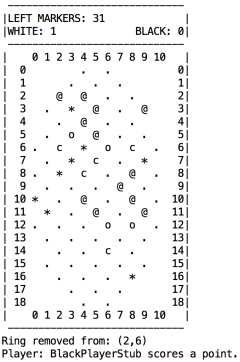
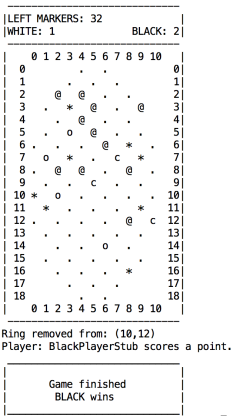

# Yinsh Game Documentation

## Game description

YINSH is an abstract strategy board game by game designer Kris Burm. It is the fifth game to be released in the GIPF Project.

Short rules version:   
The players each start with 5 rings on the board. Every time a ring is moved, it leaves a marker behind.
Markers are white on one side and black on the other. When markers are jumped over by a ring they must be flipped,
so their color is constantly changing. The players must try to form a row of 5 markers with their own color face up.
If a player succeeds in doing so, he removes one of his rings as an indication that he has formed such a row.
The first player to remove 3 of his rings wins the game. In other words, each row you make brings you closer to 
victory-but also makes you weaker, because you have one less ring to play with. Very tricky!

[Extended online rules](http://www.gipf.com/yinsh/rules/rules.html)

## Project description

Whole game is displayed in text (ASCII) version. Two players make their moves alternately. Each move is preceded by
short note about current player, type of movement and allowable input.

### How to play

Game starts with short intro with title and players rings and markers symbols. 

Before each move board in current state is displayed. At the beginning it is empty board. 

Board is followed by next movement note. 

After correct move input, appropriate symbol is placed at given position and board is redrawn. 

When each player place all rings on board, placement phase is finished. 

Then ring movement phase is continued until one of the players wins or all of markers are used. 

As long as given position is incorrect, player will be asked for new one. 

Black player completed a row of black markers. 

Row of five black markers is deleted. 

Black players scores three points. Game is finished. 

### Code

Project consist of following classes:

game.py:

* Game - general game logic

board.py

* Board - specific board logic

player.py:

* Player - handles user input
* PlayerType - enum
* WhitePlayerStub - white player stub for demo purpose
* BlackPlayerStub - black player stub for demo purpose

move.py

*  PlacementMove - Ring placement move representation (first 5 moves)
*  RingMove - Ring movement representation (rest of the moves)

main.py - run typical game `python -m yinsh.main` 
demo.py - run test demo `python -m yinsh.demo`

All test included in test directory. 
Board class is covered with tests in 78%. 
Game class cannot be easily tested because of input needed from user.
Game demo file and player stubs was created to present basic game test. 
Pylint score: 10/10.
